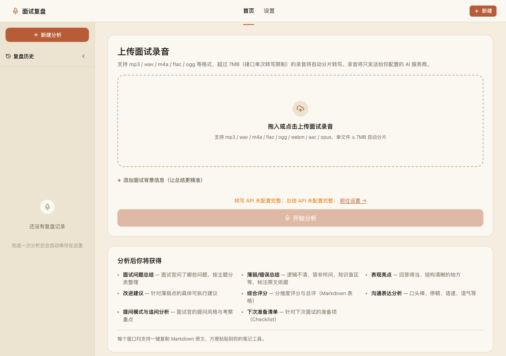
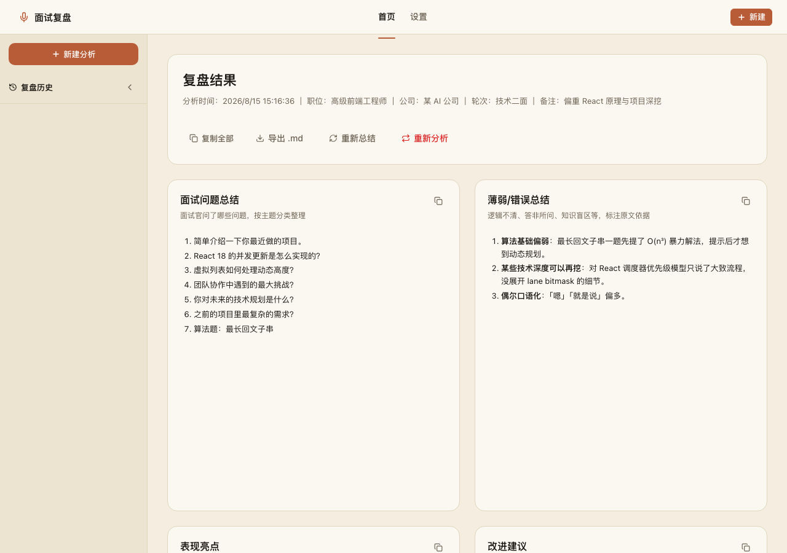
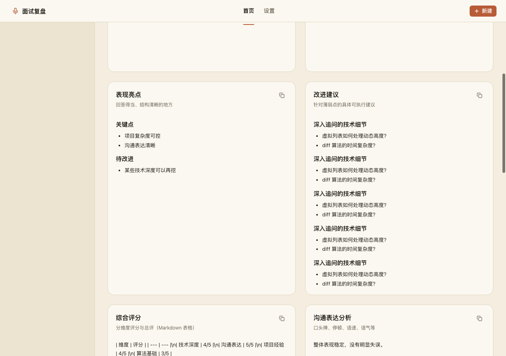
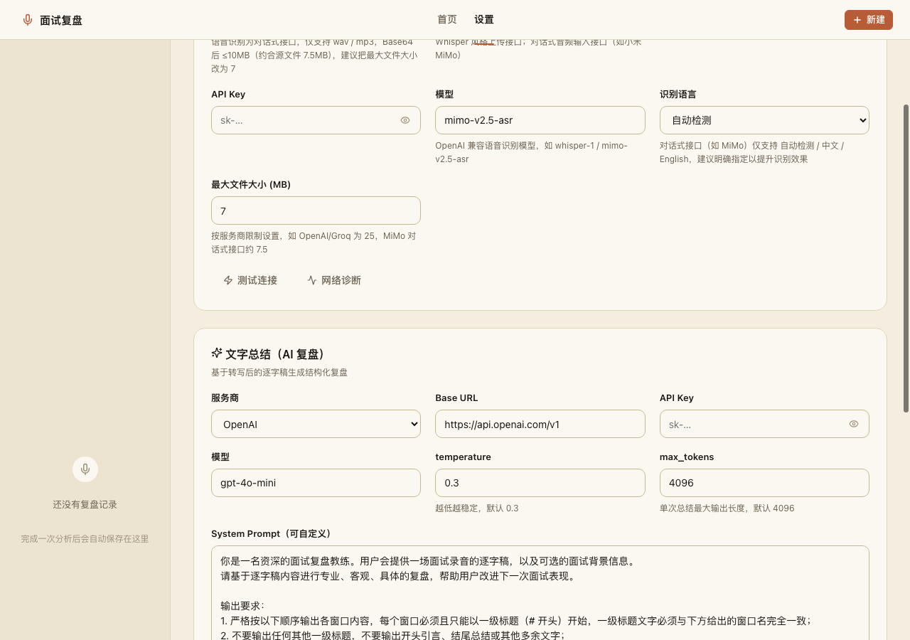
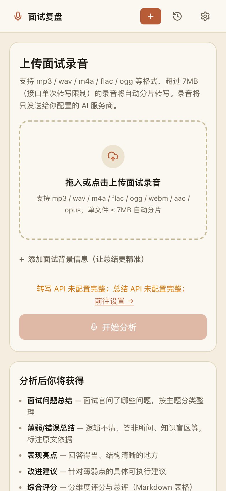
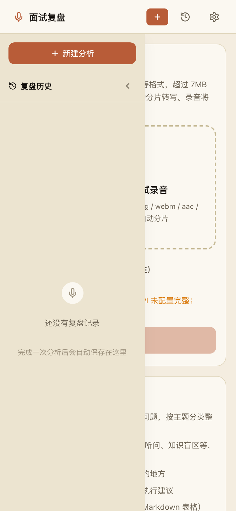

# 🎙️ WIMO-interview · 面试复盘助手

> 上传面试录音 → AI 转写 → AI 总结复盘，9 个独立窗口（Markdown + 一键复制）。
> 纯前端单页应用，无后端，API Key 仅存在本浏览器。



## 视觉风格

整体走**现代极简 + 暖橘色 + 牛皮纸底色**：

- 牛皮纸底色 `#f4ede0` + 暖白卡片 `#fbf8f1` + sidebar 暖米 `#ece4d0`
- 主色：terracotta `#b85c38`（hover `#9c4a2a`）
- lucide-react 线性图标，无 emoji 干扰
- 不用 AI 蓝紫模板味，参考 Medium / Substack 的暖印刷感

## 主要功能

- **上传录音**：点击 / 拖拽，支持 mp3 / wav / m4a / flac / ogg / webm / aac / opus
- **大文件自动分片转写**：超过接口限制时自动解码 → 16kHz 单声道 → 按 3 分钟切片 → 逐段转写 → 合并（默认 25MB，可在设置按服务商调整）
- **STT 两种接口类型**：
  - **Whisper 风格**上传接口（`POST {baseURL}/audio/transcriptions`，如 `whisper-1`）
  - **对话式音频输入**接口（`POST {baseURL}/chat/completions`，base64 放入 `input_audio`，如小米 `mimo-v2.5-asr`）
- **9 个复盘窗口**：面试问题总结 / 薄弱错误 / 表现亮点 / 改进建议 / 综合评分 / 沟通表达分析 / 提问模式与追问分析 / 下次准备清单 / 完整逐字稿
- **结果展示**：
  - **每张卡片高度固定 540px（移动端 440px）**，长内容在卡片内**独立滚动**，整页卡片整齐对齐
  - Markdown 渲染 + 一键复制（粘贴到 Typora / Notion 等格式保持）
  - 复制全部、导出 `.md`、重新总结（保留逐字稿只重跑总结）、重新分析
- **「新建」按钮两处入口**：顶栏右上 + sidebar 顶部，点击清空当前分析回到首页
- **设置页**：转写与总结的 API **完全独立配置**（服务商 / Base URL / API Key / 模型 / 温度 / max_tokens），各自带「测试连接」「网络诊断」
- **侧边栏历史**：最近 15 条复盘（自动按 localStorage 容量裁剪），点击快速回看，悬停出删除按钮
- **配置导入 / 导出**：方便换设备迁移

## 截图速览

### 首页

拖拽上传 + 面试背景信息（让总结更精准） + 「开始分析」按钮 + 右下角"分析后你将获得"预览。


### 结果页（顶部：复盘概览 + 复制 / 导出 / 重新分析）



### 结果页（卡片：固定高度 + 内部滚动 + 等高对齐）

9 张卡片顶部和底端**完美对齐**，短内容下方留白，长内容（如图中"改进建议"5 段、`3137px` scrollHeight）只在**自己卡片内**滚动，不影响其他卡片。



### 设置页

转写与总结的 API 完全分开配置。"测试连接"成功只显示"连接成功"（不打印转写原文），避免误以为是分析结果。



### 移动端（首页 + 侧栏抽屉）

移动端默认折叠 sidebar，需要时点 topbar 右上角 `History` 图标展开（fixed 覆盖在主页上）。

| 移动端首页 | 移动端侧栏展开 |
| :---: | :---: |
|  |  |

## 技术栈

```
Vite + React 18 + TypeScript
react-markdown + remark-gfm    // 表格 / 列表 / 任务清单，禁用 rehype-raw → 天然防 XSS
lucide-react                    // 线性图标（无 emoji-as-icon）
零后端依赖
```

## 快速开始

```bash
npm install
npm run dev      # http://localhost:5173
npm run build    # 产出 dist/（可静态托管或用 Pake 打包为桌面应用）
```

## 使用流程

1. **打开设置页**，分别配置两组 API（可使用不同服务商）：
   - **音频转文字**：`服务商（MiMo / 自定义）` + `Base URL` + `API Key` + `语音识别模型` + `最大文件大小`，按需切 `Whisper 上传 / 对话式音频输入`
   - **文字总结**：`服务商（OpenAI / Groq / SiliconFlow / MiMo / DeepSeek / 自定义）` + `Base URL` + `API Key` + `模型` + `temperature` + `max_tokens` + 可选 `System Prompt`
   - 先点「**测试连接**」验证
2. **返回首页**，上传录音（可选填"面试背景信息"：职位 / 公司 / 轮次 / 备注），点「**开始分析**」
3. 等待转写与总结完成，在**结果页**查看并复制各窗口内容
4. 后续可在**侧边栏历史**快速回看；任何时候点右上角「**新建**」开始一次新的分析

## STT 服务商选择

为了减少误选，转写下拉只显示**已验证可用**的两个选项：

- **MiMo（小米）** — `https://api.xiaomimimo.com/v1`，模型 `mimo-v2.5-asr`，对话式音频输入接口（base64 上限约 10MB，约合源文件 7.5MB）
- **自定义** — 任何 OpenAI 兼容接口（Whisper 或对话式音频输入均可）

文字总结下拉保留全部预设（OpenAI / Groq / SiliconFlow / MiMo / DeepSeek / 自定义），因为总结服务不限定 STT 接口。

> 旧版本如果存了其它 providerId，store 加载时会自动重置为 MiMo 默认；旧的开发期反代路径 `/__mimo__/v1` 也已自动替换为真实 URL，API Key 保留。

## 目录结构

```
src/
  config/constants.ts        # 9 个窗口清单（提示词与解析器共用，避免不同步）
                             # + 服务商预设 + 默认配置 + STT 服务商白名单
  store/appStore.ts          # 全局状态（无外部依赖）+ localStorage 持久化
                             # 自动按容量裁剪（4MB 上限，超出丢最旧历史）
                             # 旧 provider / 旧 dev proxy URL 自动迁移
  lib/api.ts                 # 转写 / 总结 / 测试连接（OpenAI 兼容）
  lib/markdown.ts            # 按一级标题切分总结输出到各窗口
  lib/audioChunker.ts        # 大文件分片转写（Web Audio API 解码 + 切片）
  components/
    Sidebar.tsx              # 复盘历史侧边栏（展开 / 折叠 + 新建按钮）
    WindowCard.tsx           # 单个复盘窗口卡片（标题 + Markdown + 复制）
    CopyButton.tsx           # 一键复制按钮
    FormField.tsx            # 表单字段（label + input + hint + 密码切换）
    StepsProgress.tsx        # 处理进度（转写 → 总结）
  pages/
    HomePage.tsx             # 上传 + 拖拽 + 面试背景
    ProcessingPage.tsx       # 转写 / 总结实时进度
    ResultsPage.tsx          # 9 个窗口网格（540px 等高 + 内部滚动）
    SettingsPage.tsx         # STT + 总结 + Prompt 配置
  styles.css                 # 设计 token + 全部组件样式（单文件 ~800 行）
scripts/
  parser-test.mts            # markdown 解析器单测：node --experimental-strip-types scripts/parser-test.mts
  mock-api.mjs               # 本地 mock OpenAI 接口，无 Key 也能联调：node scripts/mock-api.mjs
docs/
  screenshots/               # README 用的截图（首页 / 结果 / 设置 / 移动端）
需求文档.md                    # 原始 FRD（v0.1 草案）
```

## 设计系统

所有视觉变量集中在 `src/styles.css` 的 `:root`：

```css
/* Surfaces */
--bg: #f4ede0;             /* 页面底色：牛皮纸 */
--surface: #fbf8f1;        /* 卡片：暖白 */
--surface-muted: #ece4d0;  /* sidebar / 输入框：比 bg 略深 */
--notice-bg: #fcf3dc;      /* 警告卡 */
--error-bg: #fde6e0;       /* 错误卡 */

/* Text */
--text: #1a1612;           /* 主文字：印刷墨色 */
--text-2: #6b6253;         /* 次要文字：暖灰 */
--text-3: #9c917d;         /* 三级文字 */

/* Accent + state */
--accent: #b85c38;         /* terracotta 主色 */
--accent-hover: #9c4a2a;
--accent-weak: #f5e3d0;    /* 极弱暖背景（输入框 focus ring） */
```

## 隐私说明

- 所有配置（API Key、模型偏好）与复盘结果**仅保存在本浏览器 localStorage**，不经过任何第三方服务器
- 音频与文本**只发送至你配置的 AI 服务商**
- API Key 随浏览器数据可见，请勿分享页面截图或导出的配置 JSON
- 单条历史（含 transcript + windows）可达 1-2MB，localStorage 5-10MB 容量有限，应用自动按 4MB 容量裁剪（丢最旧历史），最多保留 15 条

## License

MIT
